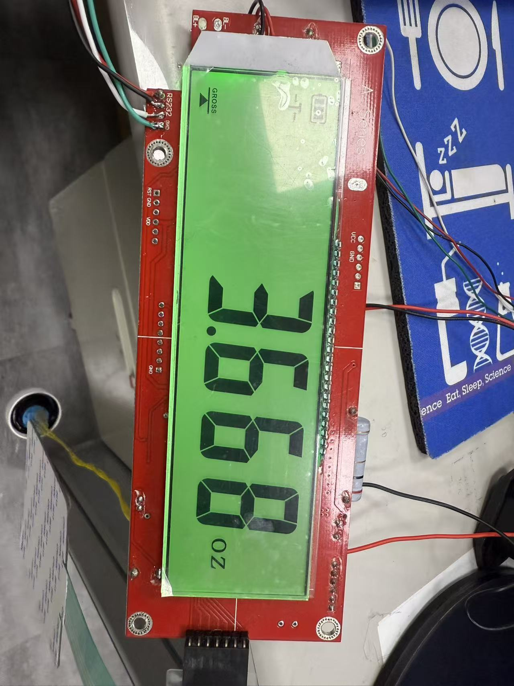
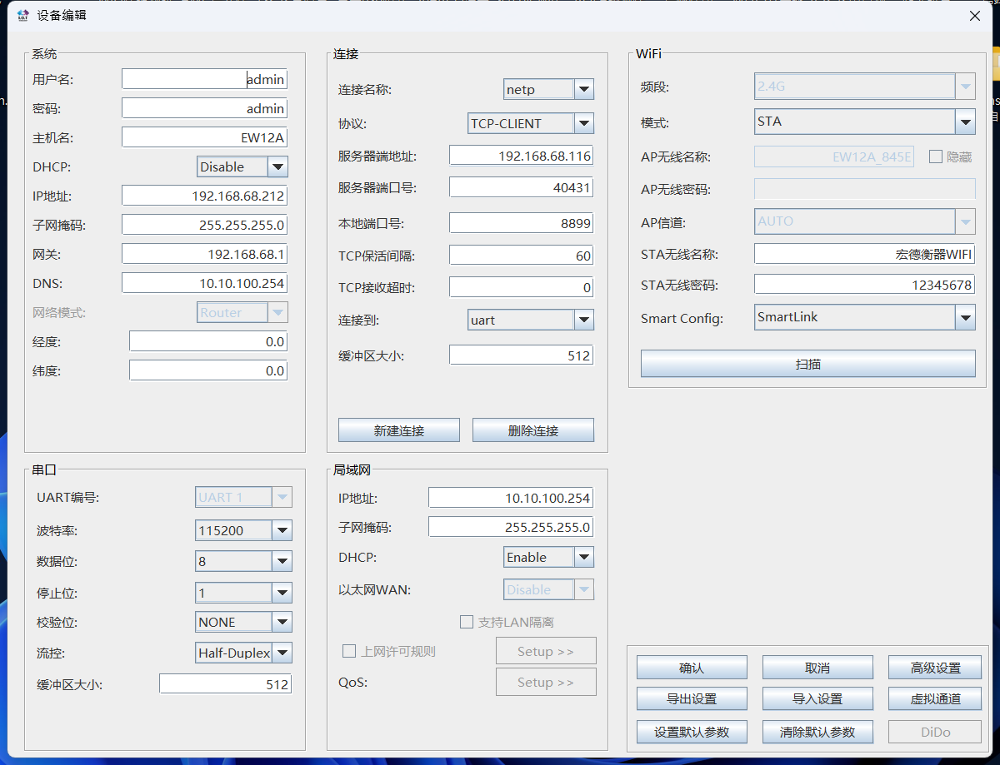
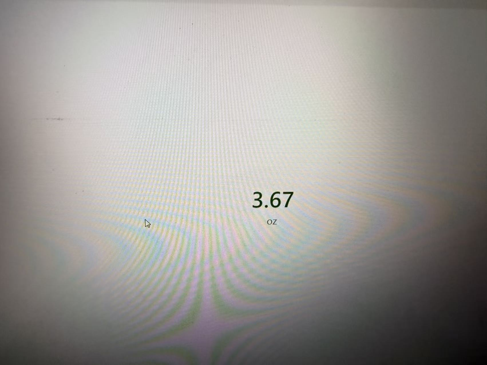

# Scale Scale Monitor

基於 WPF 的電子秤即時監控系統，通過 TCP/WiFi 連接，即時接收並顯示多台電子秤的重量數據。


## 功能特性

- **多秤同時監控** — 支持多台電子秤同時連接，以卡片式佈局即時顯示重量
- **TCP Server** — 監聽端口 `40431`，電子秤作為客戶端主動連接
- **即時重量顯示** — 網路線程與 UI 線程解耦，數據更新流暢不卡頓
- **自訂別名** — 右鍵為每台秤設置自訂名稱，使用 SQLite 持久化存儲
- **自動重連** — 內建心跳檢測與重連服務，斷線後自動恢復連接
- **快速重啟** — 透過 `SO_LINGER` 與端口復用解決 TIME_WAIT 延遲問題

## 截圖展示

### 電子秤硬體



### WiFi 模組配置



### 軟體即時顯示



## 技術架構

```
┌─────────────┐     TCP/WiFi     ┌──────────────────┐
│  電子秤設備  │ ──────────────▶ │  ScaleServer     │
│ (多台)       │    端口 40431    │  (TcpListener)   │
└─────────────┘                  └────────┬─────────┘
                                          │
                                 ┌────────▼─────────┐
                                 │ScaleClientHandler│
                                 │ (數據接收/解析)   │
                                 └────────┬─────────┘
                                          │ Dispatcher
                                 ┌────────▼─────────┐
                                 │   MainViewModel  │
                                 │  (MVVM 數據綁定)  │
                                 └────────┬─────────┘
                                          │
                                 ┌────────▼─────────┐
                                 │   WPF UI 顯示    │
                                 │  (即時重量卡片)   │
                                 └──────────────────┘
```

## 環境要求

- **OS**: Windows 10 / 11
- **.NET**: 8.0 SDK 或更高版本
- **IDE**: Visual Studio 2022（建議）

## 快速開始

### 連接電子秤

啟動應用後點擊「啟動伺服器」按鈕，伺服器將監聽 `40431` 端口。  
將電子秤的 TCP/WiFi 模組配置為連接至本機 IP 的 `40431` 端口即可。

## 數據協議

電子秤上送數據格式：

```
ST,NT,+106.0g,01
```

- **狀態** — 穩定/不穩定，如 `ST`
- **淨/毛重** — 淨重或毛重標識，如 `NT` / `GT`
- **重量** — 符號+數值+單位，如 `+106.0g`
- **通道** — 通道號，如 `01`

支持的單位：`g`、`kg`、`lb`、`oz`、`ozt`、`Lt`、`TLt` 等。

## 性能優化

- **TCP 調優** — 禁用 Nagle 演算法（`NoDelay`），適中緩衝區，超時設置
- **線程解耦** — 網路線程只負責接收，UI 線程定時批量更新
- **數據降噪** — 高頻推送時只保留最新有效數據，避免 UI 卡頓
- **快速重連** — `SO_LINGER(true, 0)` 跳過 TIME_WAIT，端口復用支持秒級重啟

## License

[MIT](LICENSE)
